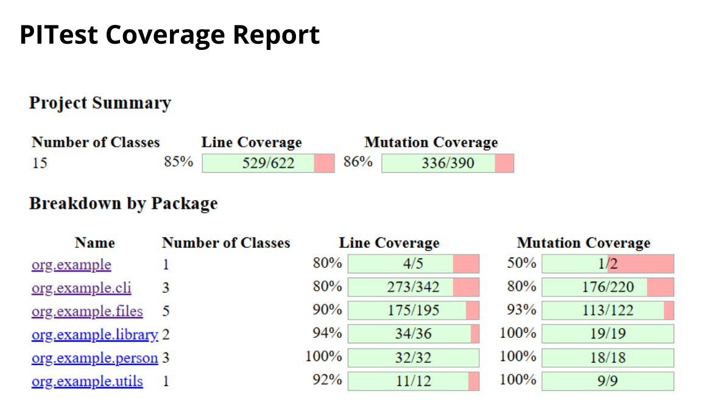

# Library Management
    A Java project about Library Management using a CLI

    

# Problem Description
**Aim**:To perform Mutation Testing on a source code. Here, the mutated program needs to be strongly killed by the designed test suite.

# PITest Report

# How to Run
We created a make file containing the following commands:

`make maven `

 This command will clean, compile, and install the project
 
`make pitest`

This command will run the PIT mutation testing on our project and it generates detailed reports.

`make run`

This command will execute the jar file generated by maven.

